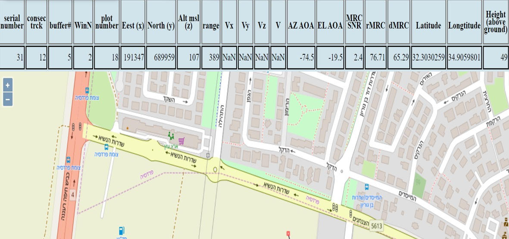

# Skimmer detection and tracking system
The project is focused on providing an offline visual tracking system for drones. The system is built on network technology and allows the user to follow the movement of an enemy drone in real-time, with an emphasis on user interaction and the effectiveness, reliability, and speed of the software. 
The project includes the use of Docker to build a tile server , allowing the program to generate and serve map tiles for real-time visualization of drone movement in offline mode.

As part of this project, I conducted research on datums and different coordinate systems and developed an algorithm that enables seamless transitions between them. I also integrated a recursive algorithm called the Kalman filter to filter noise from the data (The function of the Kalman filter is to minimize the mean square error of the estimated parameters).

One of the key features of the software is its high level of protection, which makes it almost unhackable. This makes it particularly suitable for entities like the IDF, for whom the security of the software is critical

# System Usage Guide:
1.To restore a trace, click on the "Choose file" button and select the desired file.

2.To view a summary of coordinate details, hover the mouse over the desired coordinate.

3.To view the complete gliding details of a coordinate, click on the desired coordinate.

4.To delete the old internal and external data of the map, click on the "Clean Map" button.

5.To save a tracking, click on the "Save Map" button.

6.To start listening to the radar sensors and track the movement of drones in real-time, click on the "Real Time" button.

7.To stop listening to the radar sensors and tracking the movement of drones in real-time, click on the "Stop Real Time" button

